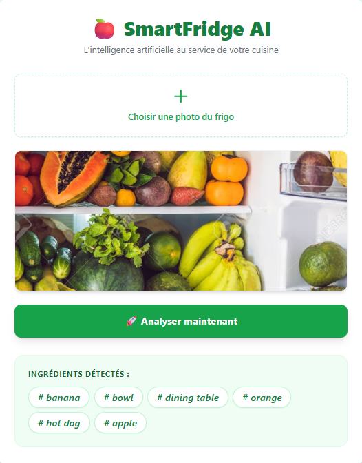

# 🍎 SmartFridge AI: The Intelligent Kitchen Assistant

[](https://www.python.org/)
[](https://fastapi.tiangolo.com/)
[](https://www.docker.com/)
[](https://ultralytics.com/)

**SmartFridge AI** is a cutting-edge web application that leverages Artificial Intelligence to identify food items inside your refrigerator from a simple photo. This project aims to reduce food waste by helping users track their inventory and plan meals efficiently.

##  Project Preview


---

##  Key Features
- **Real-Time Object Detection**: Powered by **YOLOv8** to identify fruits, vegetables, and other common ingredients.
- **Modern Web Interface**: Clean UI built with **Tailwind CSS**, featuring an instant image preview.
- **High-Performance API**: Asynchronous backend built with **FastAPI**.
- **Containerized Architecture**: Fully Dockerized for seamless deployment across any environment.

##  Tech Stack
- **Frontend**: HTML5, JavaScript (ES6+), Tailwind CSS.
- **Backend**: Python 3.11, FastAPI, Uvicorn.
- **AI/ML**: YOLOv8 (Ultralytics), OpenCV, PyTorch.
- **DevOps**: Docker, Docker Compose.

---

##  Getting Started

### Prerequisites
- [Docker Desktop](https://www.docker.com/products/docker-desktop/) installed and running.
- [Git](https://git-scm.com/) to clone the repository.

### Installation Steps
1. **Clone the repository**
   ```bash
   git clone [https://github.com/your-username/SmartFridge-AI.git](https://github.com/your-username/SmartFridge-AI.git)
   cd SmartFridge-AI

 ### Launch with Docker
docker-compose up --build

 ### Access the App

 User Interface: http://localhost